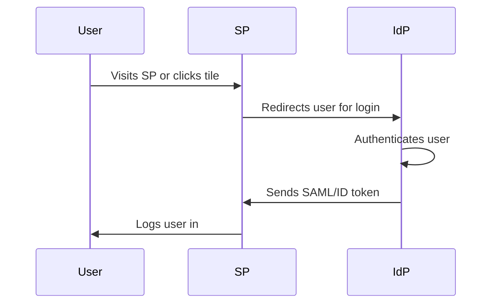
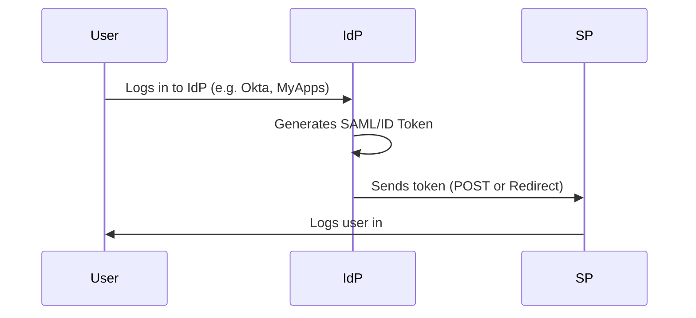
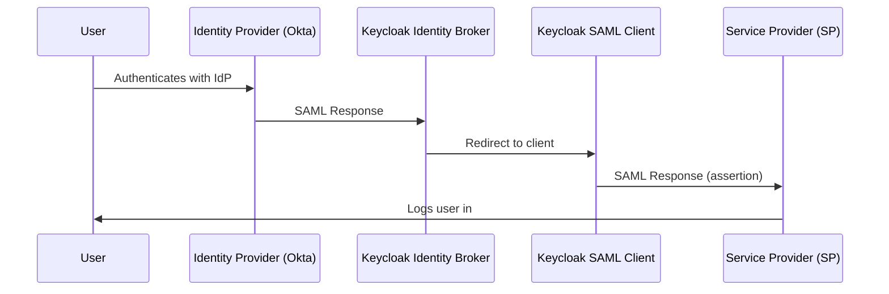
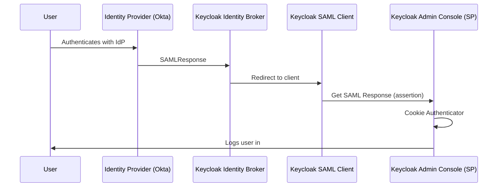

## IdP Initiated Flow

When implementing [SAML](/blog/introduction-to-simple-saml) for the establishment of an Identity Provider, two primary options are available:

1. [Service Provider](/blog/keycloak-saml-identity-provider-idp-initiated-flow-with-okta/#service-provider-initiated-flow) (SP) initiated
2. [Identity Provider](/blog/keycloak-saml-identity-provider-idp-initiated-flow-with-okta/#identity-provider-initiated-flow) (IdP) initiated

The SP initiated flow is widely recognized by users due to its straightforward configuration, which is merely the exchange of some metadata. In contrast, the IdP-initiated flow is less intuitive and involves an additional step that may not be readily apparent to many users. The purpose of this blog is to elucidate the steps necessary to successfully execute the IdP-initiated flow. We will setup a full [example](/blog/keycloak-saml-identity-provider-idp-initiated-flow-with-okta/#idp-initiated-example-setup)

A fundamental understanding of [SAML 2.0](https://en.wikipedia.org/wiki/SAML_2.0) and [Keycloak](https://www.keycloak.org/) is required to effectively follow the provided instructions.

<!-- truncate -->

:::info

If you just want to skip to the code, visit the Phase Two [IdP-initiated example](https://github.com/p2-inc/examples/tree/main/saml2/idp-initiated).

:::

## How Each Flow Works

The steps for each are similar, but also different in important ways.

### Service Provider Initiated Flow

From the user's perspective, the SP initiated flow is the most common. The user visits the SP and is redirected to the IdP for authentication. After successful authentication, the IdP sends a SAML assertion back to the SP, which then logs the user in. This looks and feels like, I go to the website, I click Log In button, and the SP sends the browser to the IdP for authentication. The IdP then sends a SAML assertion back to the SP, which logs the user in.

In most cases, this is a more secure method as the request originates with the SP. The IdP is not aware of the SP until the user clicks the login button. This is a more secure method as it prevents replay attacks and other security issues.



### Identity Provider Initiated Flow

In this case, the thing to know is that the user is already authenticated in the IdP, and the IdP will send a SAML assertion to the SP. The SP will then use this assertion to log the user in.



### Components

The components involved in this example will be as follows:

**Identity Provider:**
Any identity provider (IdP) that supports SAML 2.0 may be selected. The process begins by accessing the Identity Provider dashboard, where the user is prompted to authenticate. Upon successful authentication, the user may then request a service. For this case, we'll use [Okta](#idp-initiated-example-setup) as the IdP.

**Keycloak SAML 2.0 Identity Provider:**
The Keycloak Identity Provider will be used for identity brokering and will process the SAML Response received from the Identity Provider. It is responsible for operations such as provisioning, signature verification, decryption etc.

**Keycloak Realm Client:**
The Keycloak SAML client function is to maintain the authenticated user session within Keycloak. Another function of this generic client is to forward the authenticated user to the Service Provider.

**Service Provider:**
The Service Provider refers to the application that the user seeks to access. Once the user has been authenticated in Keycloak, a new SAML Response is generated by the realm client and subsequently consumed by the Service Provider.

## Setting up a Keycloak Instance

The example runs its own Keycloak: a Phase Two Keycloak 26.6 in Docker, on port 8080 and without the `/auth` path, like the URLs in this post. You need [Docker](https://docs.docker.com/get-started/get-docker/) with the Compose plugin. Clone the examples repo and start Keycloak from the example's folder:

```bash
git clone https://github.com/p2-inc/examples.git
cd examples/saml2/idp-initiated
docker compose up -d --wait
```

Keycloak imports the realm `test-realm` from [`keycloak/test-realm-export.json`](https://github.com/p2-inc/examples/blob/main/saml2/idp-initiated/keycloak/test-realm-export.json):

| What              | Value                                                                                                         |
| ----------------- | ------------------------------------------------------------------------------------------------------------- |
| Admin console     | [localhost:8080/admin](http://localhost:8080/admin), `admin` / `admin`                                        |
| SAML client       | `http://localhost:8081/saml2/metadata`, the SP's entity ID, with the IDP-Initiated SSO URL name `okta-client` |
| User              | `test` / `test`                                                                                               |
| Identity provider | `okta-broker`, disabled, with placeholder values for your Okta application                                    |

`docker compose down` stops Keycloak, and the next `up` imports the realm again, with new signing keys. Restart the SP after that, since it reads Keycloak's certificate only when it starts.

:::note

This isn't the shared Keycloak in the examples repo's `keycloak/` folder, which serves the `p2examples` realm for the OIDC examples. The shared Keycloak also listens on port 8080, so stop it first with `docker compose -f keycloak/docker-compose.yml down` from the repo root.

:::

<details>
  <summary>Use a hosted Phase Two cluster instead</summary>

The quickest way to get a fully-functional deployment of Keycloak is a Phase Two <a href="https://dash.phasetwo.io/" target="_blank" rel="noopener noreferrer">Starter cluster</a>, which includes a 30-day free trial.

1. Sign up on the [Phase Two Dashboard](https://dash.phasetwo.io/) with an email address, a GitHub account or a Google account.
1. Create a Starter cluster and add a realm to it.
1. Click **Open Console** to open the realm in the Keycloak admin console.

Hosted Phase Two URLs include `/auth`. Wherever this post uses `http://localhost:8080/realms/test-realm`, use your realm's URL, `https://<your-keycloak-host>/auth/realms/<your-realm>`. Your realm starts empty, so you create the identity provider and the client yourself, as the next sections describe.

</details>

## IdP Initiated Example Setup

To communicate this concept, this example will utilize

- Okta as the Identity Provider (IdP)
- Keycloak as the Identity Provider (IdP) broker
- Keycloak as the SAML client
- A simple Spring Boot application as the Service Provider (SP)



:::tip

No Okta account? Skip the Okta and identity provider steps. [Testing](#testing) starts with a quick test in which Keycloak itself is the identity provider.

:::

### Okta:

Log in to your Okta tenant and configure a new application.


You will need to specify two things:

`Single sign-on URL`: http://localhost:8080/realms/test-realm/broker/okta-broker/endpoint/clients/okta-client \
`Audience URI`: http://localhost:8080/realms/test-realm


Keep **Use this for Recipient URL and Destination URL** checked. After you save the application, assign it to your Okta user in its **Assignments** tab, so that its tile shows up on your Okta dashboard.

The identity provider `redirect url` differs from what we typically observe in Identity Provider from the Keycloak console. Based on the documentation for [IdP Initiated Login](https://www.keycloak.org/docs/latest/server_admin/#idp-initiated-login), the path `{brokerRedirectUrl}/clients/okta-client` indicates the `client-id` that is intended to maintain the service-provider application session. This will make more sense in the following steps.

### SAML 2.0 Identity Provider

The SAML identity provider `okta-broker` receives the SAML response of the application you just created in Okta. The example's realm already has it, disabled, with placeholder values (`your-okta-domain`, `your-okta-app-id`). To connect it to your Okta application:

1. In the admin console, open `test-realm` > Identity providers > `okta-broker`.
1. Replace the placeholders with the values from the application's **Sign On** tab in Okta (**View SAML setup instructions**, or the metadata URL): the identity provider entity ID (`http://www.okta.com/...`), the single sign-on service URL and Okta's signing certificate, in **Validating X509 certificates**.
1. Keep the service provider entity ID `http://localhost:8080/realms/test-realm`, and keep **Validate signatures** on: otherwise Keycloak accepts any response posted to its broker endpoint.
1. Click **Save**, then enable the provider.


On another Keycloak, or after you delete the placeholder, create the identity provider by importing the `metadata.xml` from the application you just created in Okta. To do this navigate to Identity providers > SAML v2.0. On this page, add the alias of your app (in our case it is `okta-broker`). Untoggle the "Use entity descriptor" option and select the `metadata.xml` file you downloaded from Okta. This will validate and auto-populate the correct areas. Keep the alias `okta-broker`, since the Okta single sign-on URL contains it.

## Service Provider Application

We created a simple Spring Boot app as the service provider. It has an assertion consumer service (ACS) endpoint, `/login/saml2/sso`, and the entity ID `http://localhost:8081/saml2/metadata`, where it also serves its SAML metadata. Find the code for the [example application](https://github.com/p2-inc/examples/tree/main/saml2/idp-initiated). It needs Java 17 or newer: the build compiles with a Java 21 toolchain, which Gradle downloads if you don't have one.

In `saml2/idp-initiated`, with Keycloak running, create the SP's signing key pair and start the SP on port 8081:

```bash
./scripts/generate-sp-credentials.sh
./gradlew bootRun
```

The script needs bash and OpenSSL (on Windows, use Git Bash or WSL). It writes a private key and a self-signed certificate to `credentials/private.key` and `credentials/cert.crt`, which git ignores. The SP signs its authentication and logout requests with them; IdP-initiated logins don't use them. The SP doesn't start without the key pair, or without Keycloak: at startup, it reads Keycloak's IdP metadata from `http://localhost:8080/realms/test-realm/protocol/saml/descriptor`.

Use `localhost` rather than `127.0.0.1`: the SP builds its entity ID from the host the request came in on, and the client in Keycloak only knows the `localhost` one.

On another Keycloak, point the SP at your realm before you start it: in `src/main/resources/application.yaml`, set `assertingparty.metadata-uri` to `https://<your-keycloak-host>/auth/realms/<your-realm>/protocol/saml/descriptor`.

### Keycloak Realm Client

The SP needs a SAML 2.0 client in `test-realm`. This varies from the Identity Provider we just set up: the client keeps the user's session in Keycloak and sends a new SAML response to the SP. The example's realm already has it. Its client ID is the SP's entity ID, and its Assertion Consumer Service POST Binding URL, in the client's **Advanced** tab, is the SP's ACS endpoint, `http://localhost:8081/login/saml2/sso`.


On another Keycloak, create the client by importing the metadata from the Service Provider application. Download it from `http://localhost:8081/saml2/metadata` while the SP runs, then go to Clients > Import client and upload the file. This sets the client ID, the ACS and single logout URLs and the SP's certificate, and turns **Client signature required** on, so Keycloak checks the SP's signatures. To check if the data was successfully imported, check the Assertion Consumer Service POST Binding URL, it should contain the endpoint mentioned above. Also check that **Sign documents** is on, and add `email`, `firstName` and `lastName` user property mappers if you want the SP to receive those attributes.

Now we need to return to the documentation: [IdP Initiated Login](https://www.keycloak.org/docs/latest/server_admin/#idp-initiated-login). In order to configure the IdP-initiated flow, a special field needs to be specified in the client's settings, `IDP-Initiated SSO URL name`. The example's client already has it; on another Keycloak, set it yourself:

- `IDP-Initiated SSO URL name` value of `okta-client`


The field is part of the `{brokerRedirectUrl}/clients/okta-client` url. As we can see the value is different from that of the `clientId` of the client.

## Testing

Start with a quick test without Okta, in which Keycloak is the identity provider. Open Keycloak's IdP-initiated SSO URL for the client, `http://localhost:8080/realms/test-realm/protocol/saml/clients/okta-client`, and log in as `test` / `test`. Keycloak posts a signed SAML response to the SP's ACS, and the SP shows "Authenticated", the NameID `test` and the attributes from the client's mappers: `email`, `firstName` and `lastName`. **Log out** logs you out of both the SP and Keycloak.

To test the full flow, please visit the Okta end user dashboard and select the application we created in the first step. This is the "tile" setup people are used to accessing an application. Okta posts its response to Keycloak, Keycloak posts its own to the SP, and you land on the SP logged in with your Okta username as the NameID. On the first login, Keycloak creates the user and asks you to complete the profile, unless Okta sends the email and names and `okta-broker` has attribute importer mappers for them.


For debugging purposes, you might consider using the [SAML Tracer](https://support.okta.com/help/s/article/How-to-troubleshoot-with-SAML-Tracer?language=en_US) browser extension. If you take a moment to check the requests from the flow, you'll notice that it contains only SAMLResponse messages. This is a specific characteristic of the IdP-initiated flow.

 

## What Just Happened?

We have successfully secured a web application using the SAML protocol and IdP-initiated flow with Okta. Great work!

It is important to consider that the IdP-initiated flow does present certain security concerns, such as the potential for replay attacks, spoofing, or data tampering. To ensure we uphold security, it is essential that we take all necessary precautions, including implementing assertion encryption to protect sensitive data, utilizing signing to mitigate the risk of data tampering, and proper configuration for issuer validation.

However, it is worth noting that there is still a risk that a SAML assertion could be compromised, allowing an attacker to gain access to the service provider as the affected user. While the service provider can recognize and validate the assertion because it was issued by the expected issuer and signed with the correct key, it cannot confirm whether a malicious party was involved in sending it. Given these concerns about the IdP-initiated flow and its vulnerability to certain security threats, there may be circumstances in which we find it necessary to implement it based on our specific context.

In this example, replay is a concrete risk. Spring Security accepts an unsolicited, IdP-initiated response in any browser session and doesn't remember the responses it has already accepted, so a captured response logs in again until it expires: with Keycloak's defaults, about a minute after it's issued, plus the five minutes of clock skew Spring allows. Keep the client's **Assertion Lifespan** short in Keycloak, and use HTTPS outside your machine.

## IdP-Initiated Flow Redirects to an OIDC Application {#idp-initiated-flow-redirects-to-a-oidc-application}

In the example above we configured the IdP-initiated flow to act as an identity broker and redirect to a client application which consumes SAML. Another interesting use case involves redirecting a user authenticated in the Keycloak realm to an **OIDC client application**.

Although this setup may not function seamlessly out of the box, an illustrative example can be found here: [IdP Initiated Login with Keycloak](https://www.lumilinks.com/blog/idp-initiated-login-with-keycloak).

We will also attempt to create a local setup for this use case. To do this we will follow the exact same steps from the [section](#idp-initiated-example-setup) above, until we reach the step [Service Provider Application](#service-provider-application). From there we will deviate.



### Service Provider Application

In this case the service provider application will 'talk' OIDC. As a simple example we can use the realm `security-admin-console` as the final client since it uses OIDC. An important thing to keep in mind is that for the client we will need to set a `Home URL`. In our case is the realm provisioned `http://localhost:8080/admin/test-realm/console/`.


### Keycloak Realm Client

We need to create a new SAML 2.0 client in `test-realm`. Same as the configuration above we will set IDP-Initiated SSO URL name: `okta-client`. The SP's client from the example's realm already uses that name, so clear the field on that client first.


Now comes the interesting part. Since the SAML client we created will initialize the user session in Keycloak, we will need a mechanism to attach this session to an OIDC client. We can accomplish this with a simple redirect to the OIDC application. For that, we may consider using the `SAML Redirect Binding`, which uses a `GET` request instead of a `POST` to forward the SAML assertion.

We can associate our client application `Home URL` with this configuration.


Do not forget to turn off the `Force POST binding` toggle in the SAML client general settings.

After doing all these configs we can proceed with the [Testing](#testing) phase. What we are going to observe is that Keycloak created a twin session in the `security-admin-console` client for our user.


Behind this configuration stands one magic piece which ensure the flow is going to work, the 'Cookie' authenticator. It ensures that the session for any `client` we request is first looked up in the Keycloak cookie. If the Authenticator is turned off the flow will no longer work. Our advice is to not rely on this configuration if your application will not allow Keycloak cookies.

## Conclusion

In this post, we explored the setup of an IdP-initiated flow with support for both [SAML](#idp-initiated-example-setup) and [OIDC](#idp-initiated-flow-redirects-to-a-oidc-application) applications. We also discussed some of the challenges associated with using the IdP-initiated flow and ways to address them.

We hope this has shed some light on the intricate world of Keycloak configuration and assisted you in finding a solution to your problems.

If you have any questions or would like to discuss this further, please feel free to reach out to us at [sales@phasetwo.io](mailto:sales@phasetwo.io). We are always happy to help and share our knowledge with the community.

## References

- [Keycloak with Okta IdP Initiated Login](https://www.lisenet.com/2020/keycloak-with-okta-idp-initiated-sso-login/)
- [IdP Initiated Login with Keycloak](https://www.lumilinks.com/blog/idp-initiated-login-with-keycloak)
- [Server Administration Guide](https://www.keycloak.org/docs/latest/server_admin/#idp-initiated-login)
- [IdP Initiated Login](https://groups.google.com/g/keycloak-user/c/s_sVxPGLhCs?pli=1)
