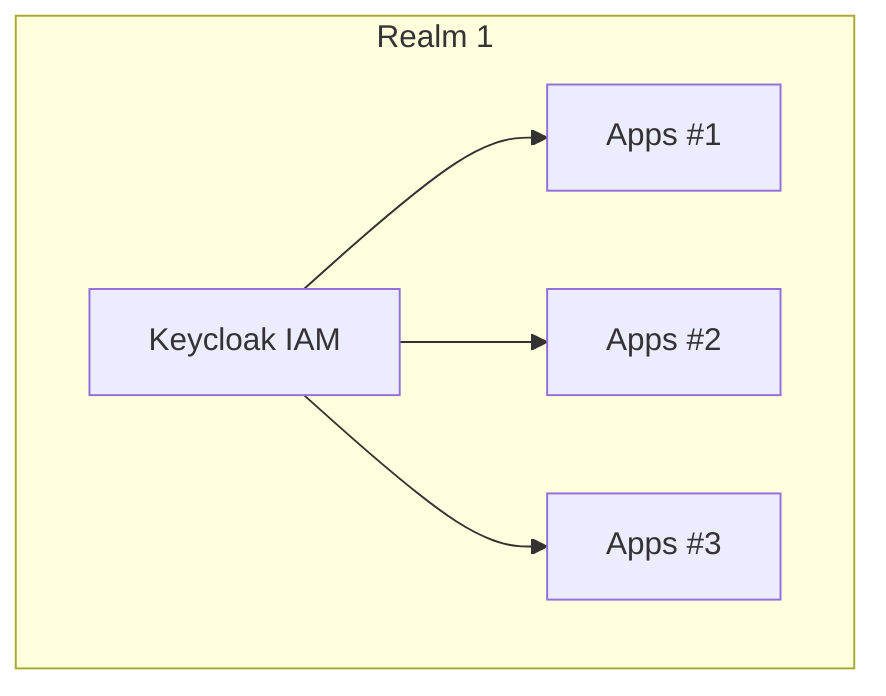
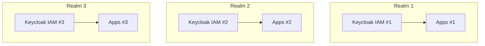
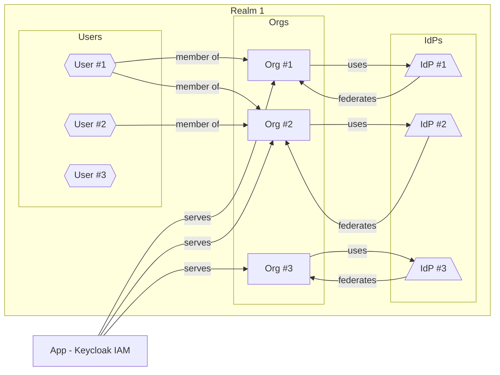

# Multi-Tenancy in Keycloak: Why Organizations Are the Future

As more companies build SaaS platforms, the need to serve multiple customer groups—or tenants—from a single system becomes critical. In the identity world, this means implementing **multi-tenancy** within your identity provider.

In this post, we’ll walk through:

- What multi-tenancy means in Keycloak
- The drawbacks of using multiple realms for tenants
- Why organizations are a better, more scalable approach
- How the Phase Two [Organizations](/product/organizations) extension supports advanced use cases like theming, shared IdPs, and user membership
- How our implementation differs from (and improves on) the new native Keycloak organizations feature

We've written extensively about how to [model multi-tenancy with organizations](./2024-11-11-multi-tenancy-with-organizations.md) and how Phase Two's [Organizations extension differs from the native implementation](./2024-07-09-organizations-shared-idps.mdx) being undertaken by the Keycloak team.

All of Phase Two's [hosted](/hosting) environments come standard with all of our [popular extensions](https://github.com/p2-inc#our-extensions-) to make it easy to hit the ground running and cover 95% of all IAM use-cases.

<!-- truncate -->

---

## What Is Multi-Tenancy?

Multi-tenancy is a system architecture where a single instance of software serves multiple logically-separated customers or organizations—each with their own users, permissions, and sometimes custom branding.

By contrast in a single-tenancy approach, there would need to be a single realm per IAM.

In Keycloak terms, multi-tenancy means allowing multiple organizations to authenticate users, manage roles, and access apps—**all from a single realm**. In a **single-tenant** architecture, each customer (or tenant) has their own Keycloak realm.

Taking the graph above and changing it to display how Organizations come into play looks as follows. Don't worry if this is confusing at first, we're going to walk through all of it.

---

## Why Multi-Realm Doesn't Work

One of Keycloak’s most common multi-tenant patterns is to create **a realm per tenant**. This seems clean at first—but has significant downsides:

### Problems with Multi-Realm:

- **Performance**: Keycloak performance degrades when you have hundreds of realms
- **Limited Cross-Tenant Features**: You can’t easily link users or resources across realms
- **Duplication**: Users with accounts in multiple realms must manage separate logins and passwords
- **Management Overhead**: Updating roles, theming, and settings across many realms is tedious and error-prone

The model simply doesn’t scale when you have 50, 100, or 500 tenants.

---

## Organizations: A Smarter Approach to Multi-Tenancy

Phase Two's [**Organizations Extension for Keycloak**](/product/organizations) enables true multi-tenancy **within a single realm**—a more scalable and resource-efficient model.

With Organizations, Keycloak gains first-class multi-tenant capabilities:

- **Organizations**: Define isolated tenant groups
- **Memberships**: Users can belong to one or more orgs
- **Org Roles**: Assign roles and permissions within each org
- **Invitations**: Invite users by email (even before they exist)
- **Domain association**: Automatically map users to orgs by email domain
- **Active organization context**: Switch between orgs in a single session

This lets you maintain secure, segmented access **without managing dozens of realms**.

---

## Theming Per Tenant (Client-Level Customization)

Need custom branding for each organization? You can theme Keycloak **per client**—and by linking each client to an organization, you effectively get **per-tenant theming**.

1. Create a separate client per organization
2. Assign custom theme to each client (via client settings)
3. Use `login_theme` and `account_theme` in client metadata
4. Use the Organization ID or client ID in templates to style login pages dynamically

This allows each org to have its own login screen—perfect for white-label SaaS.

In order to build out dynamic themes, we highly recommend leveraging [Keycloakify](https://keycloakify.com), which Phase Two [sponsors](./2024-10-09-keycloakify.mdx) and believes heavily in.

---

## Users in Multiple Organizations

Unlike the multi-realm model (where each user is siloed), the Organizations extension allows **a single user to exist in multiple organizations**:

- One email, one username, one login
- Organization-specific roles and permissions
- Ability to switch active org via the `/me` [endpoint](/api/get-me/)

This is especially powerful for admins, consultants, or vendors who interact with multiple customer orgs.

---

## Assign Identity Providers to Organizations

Organizations can now **assign the Identity Provider (IdP)** to tenants—ideal for social login or enterprise SSO scenarios like Google Workspace:

- Define a single OIDC IdP (e.g., Google)
- Map it to the orgs
- Use email domain matching to assign incoming users to the correct org

It’s centralized, scalable, and easier to manage.

---

## Get Started with Multi-Tenant Keycloak

Multi-tenancy doesn’t have to be hard—or fragile.

With Phase Two’s Organizations extension and our managed Keycloak platform, you can:

- Support any number of tenants from a single realm
- Assign custom branding per org
- Link IdPs and manage federated users
- Scale securely, with support from the people who built the system

👉 [Learn more about Organizations →](https://phasetwo.io/product/organizations)  
👉 [Get Started with Free Managed Keycloak →](https://phasetwo.io/dashboard)

📩 [Reach out to the team →](mailto:sales@phasetwo.io)
