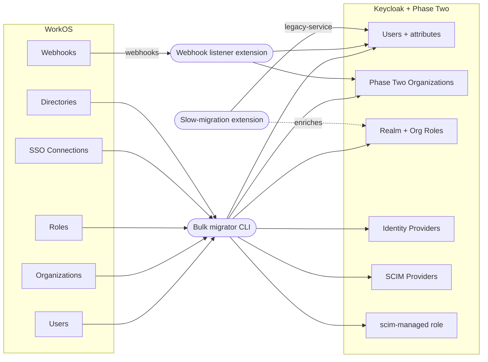

A few quarters ago you got handed a single-line ask: **"we need enterprise SSO and directory sync by the end of the quarter."** Maybe the deal was a Fortune-500 logo. Maybe it was a Series B requirement. Either way you found WorkOS, wired in their SDK in a long weekend, shipped the deal, and got the high five.

Then the renewal came in. The seat-based pricing, that sounded harmless when you had two customers using SSO, looks different when you have forty. Suddenly there's a line item on a board slide that scales linearly with your enterprise revenue — a parasite that eats into the very margin that the enterprise tier was supposed to fund. The CFO walks over and asks you to "fix it."

Here is the awkward truth nobody tells the engineer-on-the-spot: **the WorkOS feature set has had a fully open-source equivalent for years**. Keycloak handles SSO. Phase Two's [organizations](https://phasetwo.io/product/organizations/) extension handles multi-tenant orgs. The [identity provider wizard](https://phasetwo.io/product/sso/#idp-wizard) handles the same admin-portal flow your customers see in WorkOS today. The catch is that nobody wanted to spend the runway to migrate.

We've now built the tool that turns that "we'll deal with it later" debt into an afternoon of work. Why? Because WorkOS customers are starting to wake up to Keycloak, and they're coming to us in droves.

<!-- truncate -->

## What we built

The [`workos-keycloak-migrator`](https://github.com/p2-inc/workos-keycloak-migrator) is a small multi-module Maven project that does three things in lockstep:



| Component | What it does |
| --- | --- |
| **Bulk migrator CLI** | A standalone `java -jar` that reads everything WorkOS exposes via API and writes it into Keycloak + Phase Two. Idempotent — re-run it whenever you want a fresh reconciliation. |
| **Webhook listener extension** | A Keycloak `RealmResourceProvider` that subscribes to WorkOS webhooks and applies live updates while the two systems run in parallel. |
| **Slow-migration extension** | Bridges [keycloak-user-migration](https://github.com/daniel-frak/keycloak-user-migration) to WorkOS so users who haven't been touched in a while can still log in with their WorkOS password the first time and get materialised into Keycloak on demand. |

Every entity we touch carries a `workos.id` attribute so the migrator can recognise it on every subsequent run — no duplicates, no drift.

## How to use it

We deliberately kept the runbook short. Here are the six steps:

### 1. Build the artifacts

```bash
mvn -DskipTests package
```

This produces three jars:

- `migrator/target/workos-keycloak-migrator.jar` — the bulk runner.
- `extensions/webhook-listener/target/workos-webhook-listener.jar` — drop into Keycloak's `providers/` directory.
- `extensions/slow-migration/target/workos-slow-migration.jar` — same place.

The build is plain Maven so it slots into whatever CI you already use.

### 2. Stand up a Phase Two-enabled Keycloak

If you already run Phase Two's [hosted offering](https://phasetwo.io/) or your own Phase Two containers, point at that. If you're trying this locally first, the repo ships a `docker-compose.yml` that brings up Postgres plus the [phasetwo-keycloak image](https://quay.io/repository/phasetwo/phasetwo-keycloak) with both extension jars mounted:

```bash
docker compose up -d
```

### 3. Bootstrap the realm

```bash
./scripts/bootstrap-realm.sh
```

This creates the `migrate-target` realm, flips a couple of Keycloak defaults that would otherwise eat our attributes (`unmanagedAttributePolicy=ENABLED` and `sslRequired=NONE` for local HTTP), and creates a `migrator-cli` service-account client with `realm-admin`. The script prints the client secret you need for step 4.

**Why a service-account client?** The bulk migrator authenticates against Keycloak using OAuth client-credentials. Putting it in its own client (instead of, say, reusing the `admin` master user) keeps the credential surface area small and auditable.

### 4. Run the bulk migrator

```bash
java -jar migrator/target/workos-keycloak-migrator.jar \
  --workos-api-key=$WORKOS_API_KEY \
  --keycloak-url=https://your-keycloak.example.com \
  --keycloak-realm=migrate-target \
  --keycloak-client-id=migrator-cli \
  --keycloak-client-secret=$KC_CLIENT_SECRET \
  --source-label=production
```

The runner walks WorkOS in dependency order — environment roles first, then organizations, then per-org roles, then identity-provider stubs, then SCIM stubs, then users, then memberships, then directory users — and prints a summary at the end:

```
============= Migration summary =============
role:                    {CREATED=5}
organization:            {CREATED=7}
organization_role:       {CREATED=38}
identity_provider:       {PARTIAL=2}
user:                    {CREATED=10}
organization_membership: {CREATED=10}
Total failed: 0
```

Re-running picks up where the last run left off (cursors are persisted on the realm), and reports `SKIPPED reason=unchanged` for anything that hasn't drifted since the last sync. This is what lets you keep both systems in parallel — run the migrator daily in a cron job and the WorkOS state shows up in Keycloak each morning.

### 5. (Optional) Enable the extensions

Both Keycloak extensions are **opt-in per realm** because we don't want a one-shot `docker compose up` to fan out across every realm in a shared cluster. Set:

```
KC_SPI_REALM_RESTAPI_EXTENSION_WORKOS_WEBHOOK_REALMS=migrate-target
KC_SPI_REALM_RESTAPI_EXTENSION_WORKOS_LEGACY_REALMS=migrate-target
```

(or `*` for "every realm") and restart Keycloak. The webhook listener will auto-register a WorkOS webhook endpoint on first boot; the slow-migration extension will install the federation component that asks our resource for users it doesn't recognise.

The webhook listener requires an HTTPS URL because WorkOS won't accept anything else for delivery. If you only have HTTP locally, the listener still serves traffic — it just skips the auto-provisioning step and waits for you to register an HTTPS endpoint yourself.

### 6. Re-run for reconciliation whenever you like

The bulk migrator is idempotent and cheap to re-run. Many teams run it nightly during the parallel-operation window, then switch off WorkOS once they're happy with the diff.

## What the migrator cannot import (and why)

There are two pieces of WorkOS state that we cannot pull through the API:

### SSO connection secrets and metadata.

The WorkOS `/connections` endpoint exposes the connection's _type_ (Okta SAML, Azure SAML, Google OIDC, etc.) and the organization it's attached to, but **not** the SAML metadata URL, the OIDC client_id/secret, or any of the SSO/SLO URLs. Those were entered into WorkOS through their admin portal by the customer's IT team and are not retrievable.

The migrator handles this honestly: it creates a Keycloak identity provider for every connection with the right `providerId` (`saml`, `oidc`, `google`, `microsoft`, etc.), copies the SAML signing certificate when WorkOS happens to expose it, and tags every record with `workos.incomplete=true` and `workos.connection_id=<the original id>`. You end up with a placeholder you can finish in two clicks via Phase Two's [IdP Wizard](https://phasetwo.io/extensions/idp-wizard/) — or even better, by sending a [portal link](https://phasetwo.io/extensions/admin-portal/) to the customer's IT contact and letting them re-walk the same setup flow they already know.

### SCIM directory connection auth

Same shape: `/directories` tells you the directory exists, what provider (Okta SCIM, generic SCIM 2.0, Azure SCIM, etc.) and which organization it belongs to — but the bearer token your customer's IdP uses to push users is opaque to the WorkOS API. The migrator creates a Phase Two SCIM provider on the right org with a placeholder secret and the same `workos.directory.incomplete=true` tag so it stands out in the admin UI.

In both cases the customer's IT team has to re-establish the secret. The good news: they only have to do it once, and Phase Two's admin portal flow is the same one they already used for WorkOS, just with a different brand on it.

## What happens after the migrator runs

Three things you'll want to do in the days following the migration:

**1. Walk the `workos.incomplete=true` records.** Filter your Phase Two organizations by that attribute and you'll see exactly which connections need attention. Send a portal link to each affected customer's IT contact. They click through the same identity-provider wizard their team used in WorkOS; ten minutes later the IdP is live in Keycloak and the `workos.incomplete` tag goes away on the next reconciliation run.

**2. Audit the `scim-managed` realm role.** Every user that originated from a WorkOS Directory Sync gets the `scim-managed` realm role plus `scim.directory_id` / `scim.directory_user_id` attributes. That's your "do not deprovision" list — anyone with that role is being managed by upstream SCIM, so a manual admin deletion is going to get reversed. The role gives you an easy filter in the admin UI and a stable bit of state you can hook into your own provisioning logic.

**3. Install the slow-migration extension (if you haven't already) before pointing your login UI at Keycloak.** Without it, users whose passwords never made it through the migration (WorkOS doesn't let us export them — they're hashed, scoped to WorkOS's authentication endpoint) will fail their first login. With it, their first login gets verified against WorkOS by our extension, then their password hash is captured and stored in Keycloak. After that they look identical to a native Keycloak user.

Once those three things are done you can flip your AuthKit-style flows to Keycloak, point your application at the new realm, and start the WorkOS cancellation timer.

## The bigger picture

If you've made it this far you're probably nodding along — the technical migration is straightforward, the gotchas are small, and the math on the new cost line is much better. But it's worth saying out loud what the rest of the move looks like.

WorkOS's pitch was always "we make enterprise auth easy for SaaS developers." The pitch worked because, until recently, the open-source alternative had no admin portal, no IdP wizard, no SCIM Box, no domain verification flow — only the raw Keycloak primitives. To replicate WorkOS's developer experience you had to build the whole admin surface yourself.

[Phase Two has built that admin surface.](https://phasetwo.io/) The [organizations](https://phasetwo.io/extensions/organizations/) extension gives you multi-tenant orgs with role-based assignments. The [IdP Wizard](https://phasetwo.io/extensions//idp-wizard/) replaces the WorkOS connection setup flow. Phase Two SCIM gives you the same managed directory-sync experience. The [portal link](https://phasetwo.io/extensions/admin-portal) experience lets you delegate SSO/SCIM setup to your customer's IT team without giving them admin access to your Keycloak — exactly the same delegation model WorkOS uses, with the same UX, just running on Keycloak you control.

The crucial difference, and the reason the migration is worth doing: [**Phase Two's pricing doesn't grow with your enterprise revenue.**](https://phasetwo.io/pricing/hosting/) SSO, SCIM, organizations, branding, the wizard — they're all part of the platform, not metered features. Your cost stays a predictable budget line item whether you have ten enterprise customers or ten thousand.

The migrator we just walked through is, in that sense, the smallest part of the story. It's the bridge that lets a team that originally chose WorkOS for time-to-market cross over to a platform that doesn't tax that decision forever.

If you've got a WorkOS migration on your roadmap and would like a hand, [reach out](https://phasetwo.io/contact/) — we've now done this end-to-end on a real WorkOS Sandbox tenant and the tooling is open source. We'd be happy to walk you through it.
