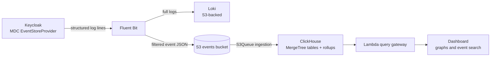

Every login, logout, failed password attempt, and admin change in Keycloak produces an event. That's exactly what you want for security auditing and product analytics — until you realize where Keycloak puts them: **in the same relational database that your authentication path depends on**. At scale, event storage becomes a problem you can't ignore. Here's how we solved it, and how the key piece — an MDC-logging `EventStoreProvider` — is open source so you can solve it too.

<!-- truncate -->

## The Problem: Your Auth Database Is Not an Analytics Database

Out of the box, Keycloak stores events in the `EVENT_ENTITY` and `ADMIN_EVENT_ENTITY` tables via its JPA event store. This works fine for a small realm. It works a lot less fine when you're hosting many busy realms:

- **Event writes ride the request transaction.** The JPA event store persists events inside the same transaction as the request that produced them. Every login is now gated on an extra insert: if the database is slow, the request thread waits; if event persistence fails, it can take the whole request down with it. Your users are paying an event-storage tax on every authentication, and your busiest login day is also your busiest event-write day.
- **Big tables are operationally fragile tables.** Once `EVENT_ENTITY` grows into the tens or hundreds of millions of rows, routine maintenance becomes dangerous. A Keycloak upgrade that touches the event schema can hold a lock on a table that every in-flight request is trying to insert into — and now request threads are hanging behind a migration. The same goes for adding an index or any other DDL you'd normally consider harmless.
- **Expiry is a bulk `DELETE` against your hot path.** Keycloak's event expiry doesn't make old events quietly disappear — it runs mass deletes against the very tables your logins are writing to, generating lock contention, vacuum/bloat pressure, and I/O spikes. So you're stuck choosing between unbounded growth and periodic self-inflicted incidents, and either way you lose the long history your customers actually want.
- **Queries that hurt.** "Show me all failed logins for this user over the last 90 days" is an analytics query: a full scan over a huge, write-hot, row-oriented table. Running analytics queries against your production auth database during business hours is how you end up on a status page.

Our customers were asking good questions — *How many active users did we have last month? When did failed logins spike? Who changed that client configuration?* — and the honest answer was that the default event store isn't built to answer them at scale.

We wanted three things at once:

1. Keep the auth database small, fast, and boring.
2. Keep events **forever** (or at least long enough for real analytics and audit).
3. Make months of events queryable in milliseconds, with dashboards on top.

## The Insight: Events Are Logs

An authentication event is immutable, timestamped, and append-only. That's not a database row — that's a **log line**. And modern infrastructure is extremely good at moving, storing, and analyzing log lines cheaply.

So instead of treating the database as the system of record for events, we restructured the whole thing as a pipeline:



Each stage does one job, and each stage is independently scalable. Let's walk through them.

## Step 1: An Open-Source EventStoreProvider That Writes Events as Structured Logs

The foundation lives in our open-source [keycloak-events](https://github.com/p2-inc/keycloak-events) extension (also on [Maven Central](https://central.sonatype.com/artifact/io.phasetwo.keycloak/keycloak-events)). We added a new implementation of Keycloak's `EventStoreProvider` SPI: the **MDC Logger Event Store** (`ext-event-mdc-logger-store`).

Instead of (or in addition to) writing events to JPA, it flattens each user and admin event and emits it as a structured log line, with every field carried in the [MDC](https://logging.apache.org/log4j/2.x/manual/thread-context.html) (Mapped Diagnostic Context). When Keycloak logs to JSON on stdout — standard practice in containers — every event comes out as a machine-parseable record:

```json
{
  "timestamp": "2026-06-22T14:03:11.402Z",
  "loggerName": "io.phasetwo.keycloak.EVENT_LOGGER",
  "message": "Event Logger",
  "mdc": {
    "event.class": "USER",
    "event.id": "a1b2c3d4-...",
    "event.type": "LOGIN",
    "event.realmName": "acme",
    "event.clientId": "web-app",
    "event.userId": "8f14e45f-...",
    "event.ipAddress": "203.0.113.7",
    "event.time": "1750601391402",
    "event.detailsJson": "{\"auth_method\":\"openid-connect\", ...}"
  }
}
```

A few design decisions turned out to matter a lot:

**Dual write is a config flag, not a fork.** The provider can wrap Keycloak's built-in JPA event store, so you can run both stores side by side while you build out your pipeline. Events land in the database (so the Admin Console and Events REST API keep working exactly as before) *and* in your logs. Once your downstream pipeline is trustworthy, flip `use-jpa` off and your database stops accumulating events entirely:

```bash
export EXT_EVENT_MDC_LOGGER_ENABLED=true
kc.sh build
kc.sh start \
  --spi-events-store-provider=ext-event-mdc-logger-store \
  --spi-events-store-ext-event-mdc-logger-store-use-jpa=true
```

**Events are emitted post-commit.** Events are queued in the Keycloak transaction and only logged after it commits. A rolled-back request never produces a phantom event, so your analytics never disagree with reality.

**MDC context is scoped, not leaked.** Keycloak reuses executor threads, and MDC state is thread-local. The provider sets the `event.*` MDC keys inside a try-with-resources scope and restores the previous values immediately after the log call, so event fields never bleed into unrelated log lines on the same thread.

**Separate loggers for user and admin events.** User events go to `io.phasetwo.keycloak.EVENT_LOGGER` and admin events to `io.phasetwo.keycloak.ADMIN_EVENT_LOGGER`, which makes downstream routing and filtering trivial — you match on the logger name, not on fragile message parsing.

**Graceful degradation.** When JPA is disabled, the provider returns empty query results rather than throwing, so the Admin Console's Events tab degrades quietly instead of erroring.

This provider is [Elastic License 2.0](https://github.com/p2-inc/keycloak-events/blob/main/LICENSE) like the rest of the keycloak-events extension — free to use in your own deployments. Everything downstream of it is just standard logging infrastructure, which is exactly the point: **once your events are structured log lines, the entire observability ecosystem becomes your event store.**

## Step 2: Filter and Ship — Fluent Bit, Loki, and S3

On every node in our clusters, [Fluent Bit](https://fluentbit.io/) tails the Keycloak container logs and does the routing:

- **Full Keycloak logs** go to [Loki](https://grafana.com/oss/loki/) (itself backed by S3, with a 90-day retention policy) for operational debugging and ad-hoc log queries.
- **Event lines only** — matched by those two dedicated logger names — get a much more interesting treatment. Fluent Bit strips each record down to just the `mdc` payload, **redacts PII fields** like IP addresses and usernames before they ever leave the node, and writes the results as JSON-lines files to a dedicated S3 bucket, partitioned by cluster and date.

That filtering step is what keeps the pipeline lean. Loki holds everything for the ops team; the events bucket holds exactly one clean, structured record per event and nothing else. S3 becomes the durable, dirt-cheap, infinitely-retained system of record — and because it's just JSON in a bucket, we're never locked into any particular downstream consumer.

## Step 3: ClickHouse Ingestion with S3Queue

For the analytics layer we chose [ClickHouse](https://clickhouse.com/), running alongside each cluster. The ingestion mechanism is one of ClickHouse's best-kept secrets: the [`S3Queue` table engine](https://clickhouse.com/docs/en/engines/table-engines/integrations/s3queue), which continuously watches an S3 prefix and streams new files in as they appear:

```sql
CREATE TABLE keycloak_events.s3_keycloak_event_queue (raw String)
ENGINE = S3Queue('https://<bucket>.s3.amazonaws.com/*/*/*', JSONAsString)
SETTINGS mode = 'unordered',
         keeper_path = '/clickhouse/s3queue/keycloak-events';
```

No Kafka, no scheduled batch jobs, no ingestion service to babysit. ClickHouse's Keeper tracks which S3 objects have been processed, giving us reliable exactly-once-style ingestion with zero moving parts beyond ClickHouse itself.

From the queue, a chain of materialized views does the shaping:

1. A **raw landing table** (MergeTree, partitioned by month) captures every line with its source file metadata and the extracted cluster, realm, and event class.
2. **Typed tables** for user and admin events extract each `event.*` field into a proper column — `event_type`, `user_id`, `client_id`, `ip_address`, `operation_type`, `resource_path`, and so on. These use `ReplacingMergeTree` keyed on ingest time, so if a file is ever re-delivered after a crash, duplicates collapse away at merge time.
3. **Five-minute rollup tables** (`SummingMergeTree`) pre-aggregate event counts by realm, event type, and error. Five minutes divides evenly into every interval our dashboards offer (15 minutes, 1 hour, 1 day), so a single rollup grain serves every zoom level.

One honest lesson from production: we initially experimented with S3-backed MergeTree storage for the ClickHouse tables themselves, and walked it back. Every part write, merge, and TTL operation turned into S3 `PutObject` churn — on the order of 150 requests per second per cluster — and the API request costs showed up on the bill fast. Local NVMe-backed volumes for the tables, with S3 as the ingestion source and archive, turned out to be the right split.

## Step 4: A Lambda Gateway to Expose Queries as Web Services

ClickHouse lives on a private network, and we didn't want dashboards talking SQL to it directly. So we put a small **AWS Lambda behind an HTTP API Gateway** in front of it, exposing a handful of purpose-built REST endpoints:

- `/insights/user-events` and `/insights/admin-events` — filtered, paginated event search (by realm, event type, user, client, IP, time range, plus full-text search over event details)
- `/insights/metrics` — named, pre-defined aggregations: successful and failed logins, registrations, password resets, MFA enrollment, lockouts, DAU/WAU/MAU, and a session-concurrency estimate

The security model is deliberately narrow. API Gateway validates a **JWT** on every request (issued, naturally, by Keycloak). The Lambda then checks a cluster claim in the token against the cluster being queried, so a tenant can only ever see their own events. And there is no free-form SQL anywhere in the API — every endpoint maps to a parameterized query using ClickHouse's native `{param:Type}` placeholders, which makes injection structurally impossible rather than merely filtered.

The metrics endpoints read from the rollup tables and re-bucket the five-minute grain to whatever interval the caller asks for, so even "show me a year of logins by day" comes back in tens of milliseconds.

## Step 5: Dashboards People Actually Use

The final layer is the UI in the Phase Two dashboard: an events section per cluster with two complementary views.

**Metrics** shows stacked charts of user events by type and admin events by resource and operation, plus a grid of the questions customers actually ask: successful vs. failed logins over time, daily active users, DAU/WAU/MAU tiles, new registrations, password resets, MFA enrollments and removals, login error breakdowns, and session concurrency. Drag-select on any chart zooms every chart on the page to the same window.

**Event search** is a virtualized table over the raw events with the full filter set — realm, event type, user, client, IP, time range, free-text search over event details — and a detail drawer showing the complete event payload with copy-to-clipboard JSON.

The little UX decision we're proudest of is the **drill-down**: click any segment of a stacked bar — say, the `LOGIN_ERROR` slice at 3 AM on Tuesday — and you land in the event search view, pre-filtered to that event type and that time bucket. Aggregate to instance in one click. That interaction is only cheap because the layers below it are: the chart is a rollup-table query and the drill-down is a typed-table query, both answered by the same gateway in milliseconds.

## What We Got

The scoreboard after moving event storage out of the database:

- **The auth database does auth.** Event writes, event expiry deletes, and analytics queries are gone from the hot path entirely.
- **Retention is no longer a trade-off.** S3 keeps the raw events indefinitely for peanuts; ClickHouse keeps them queryable.
- **Analytics got fast.** Questions that were previously unaskable — a year of login trends across a busy realm — return interactively.
- **Every layer is replaceable.** Because the contract between Keycloak and everything else is just structured JSON log lines, you could swap Loki for Elasticsearch, ClickHouse for BigQuery, or our dashboard for Grafana, and the provider wouldn't know or care.

## Build It Yourself

The piece that makes all of this possible — the MDC Logger `EventStoreProvider` — is open source in [p2-inc/keycloak-events](https://github.com/p2-inc/keycloak-events), alongside our webhook and scripting event listeners. If you run your own Keycloak, you can drop in the extension, enable the provider, and point whatever log pipeline you already have at those two logger names. The [README](https://github.com/p2-inc/keycloak-events#mdc-logger-event-store) covers configuration in detail, and we'd love to hear what you build on top of it.

And if you'd rather not run any of this yourself — the provider, the pipeline, the ClickHouse cluster, the dashboards — that's quite literally what we do. Every Phase Two hosted deployment gets this event analytics stack out of the box, along with a team that has already found the sharp edges for you.

---

**Want to talk Keycloak event analytics, or scaling Keycloak in general?**

- 📩 [Reach out to the team →](mailto:sales@phasetwo.io)
- 👉 [Get Started with Free Managed Keycloak](https://dash.phasetwo.io/)
