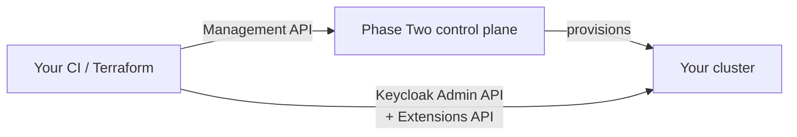

# Management API

Everything you can do in the Phase Two console, you can do from code. Create a cluster, add a
realm to it, attach a custom domain, upload an extension, restrict admin access by IP, pull
logs — all of it over HTTP with an API secret.

This section is the **guide**. If you want the endpoint-by-endpoint reference, that is the
[Management API reference](/api/management-api-index).

## Start here

|                                                          |                                                                                                             |
| -------------------------------------------------------- | ----------------------------------------------------------------------------------------------------------- |
| [**API keys**](/docs/management-api/api-keys)            | Create an API secret, exchange it for a token, and make your first call. Start here.                        |
| [**Automation recipes**](/docs/management-api/recipes)   | Worked end-to-end examples: provision a cluster, onboard a tenant, add a custom domain, rotate credentials. |
| [**Terraform provider**](/docs/management-api/terraform) | Manage the same resources declaratively instead of scripting the API.                                       |
| [**API reference**](/api/management-api-index)           | All 73 endpoints, with schemas and try-it.                                                                  |

## What this API is not

It manages clusters, not what runs inside them. There is no endpoint here to create a user, a
client, or an authentication flow — those belong to the realm, and you reach them with
[Keycloak's Admin REST API](https://www.keycloak.org/docs-api/latest/rest-api/index.html) plus
our [Extensions API](/api/extensions-api-index), pointed at your cluster's own hostname.

The usual division of labour in an automated setup:

The Management API gets you a realm. Everything after that is Keycloak's own API against the
cluster it created.

## Two hostnames

This trips people up more than anything else, so it is worth internalising early.

| Host                | Role                                    |
| ------------------- | --------------------------------------- |
| `app.phasetwo.io`   | The console, **and the token endpoint** |
| `api.phasetwo.io`   | The Management API                      |
| your cluster's host | Your Keycloak — realms, users, logins   |

You authenticate against `app.` and then call `api.`. Two different hosts in the same script is
unusual enough that it is worth a comment where you write it down.

Staging mirrors this with `app-staging.phasetwo.io` and `api-staging.phasetwo.io`. The two
must match: a token minted on one environment's console host is not valid on the other's API
host.

## What you can automate

| Area               | Examples                                                                                           |
| ------------------ | -------------------------------------------------------------------------------------------------- |
| **Clusters**       | Create, inspect, delete; check name availability; list regions; read metrics; watch restart status |
| **Realms**         | Add and remove deployments on a cluster; import an existing realm export; mint admin console links |
| **Custom domains** | Attach a hostname, read the DNS records to create, watch certificate issuance, promote to primary  |
| **Extensions**     | Upload custom providers and themes, manage per-Keycloak-version builds, trigger the reconcile      |
| **Configuration**  | Custom SPI environment variables; admin and realm IP allow/deny lists                              |
| **Operations**     | List and download log files                                                                        |
| **Billing**        | Subscriptions, payment methods, billing contacts, portal links                                     |
| **Credentials**    | Create, list and revoke the API secrets themselves                                                 |

## Things to know before you build on it

**Provisioning is asynchronous.** Creating a cluster returns immediately; the cluster is not
usable until its `status` reaches `ACTIVE`. Poll, don't assume.

**Some changes restart Keycloak.** Environment variables and extension reconciles restart the
cluster. The API refuses a second one while the first is in flight, so serialize them.

**Deleting a cluster is deferred.** It moves to `PENDING_DELETION`, bills to the end of the
period, and keeps its name reserved. Do not build a create/destroy loop on one name.

**Least privilege works.** An API secret gets organization roles, and a secret with only view
roles gets 403 on writes. Give your monitoring job a read-only secret.

All four are covered with the actual calls in [Automation recipes](/docs/management-api/recipes).
